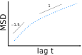
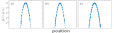
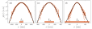
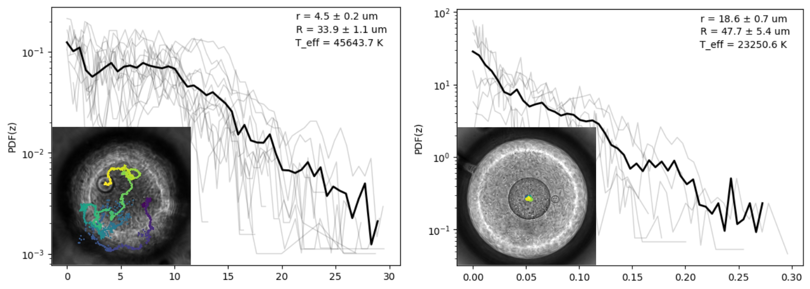
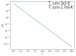
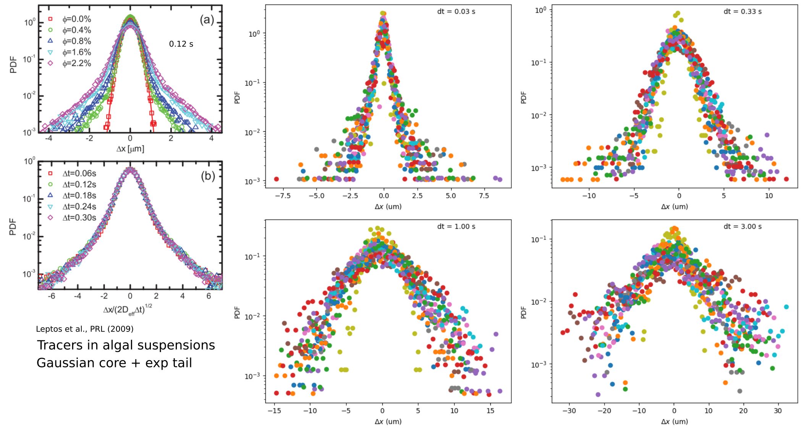
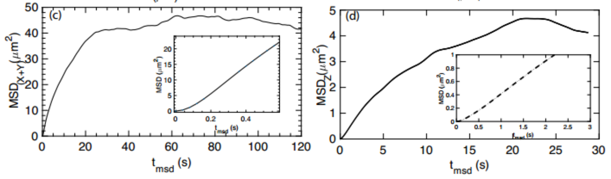
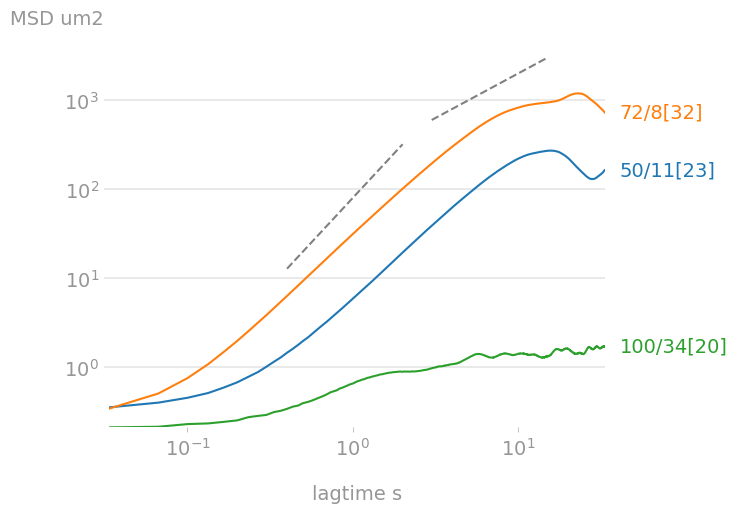

# Diffusivity and Effective Temperature
We want to measure the effective temperature of an active bath.

Such an idea has been employed in early experimental works (Wu 2000, Palacci 2010), where the dynamical statistics of passive tracers are exactly the same as Brownian motion, except that it has  a higher effective temperature, i.e. a broader position distribution. **The active bath can be essentially treated as "a hot passive bath".**

This idea has been shown to have some limitations. In some cases, Boltzmann distribution breaks down due to comparable length and velocity scales between active particles and external potential (Tailleur 2009, Argun 2016). In some cases, due to complex confining walls, there are multiple effective temperature in the same system (Maggi 2014).

Some questions have to be answered before we can proceed with actual measurements of effective temperature.

## Some Questions

### 1. How to measure the effective temperature of an active bath?

Two ways: (i) fluctuation-dissipation relation; (ii) Boltzmann distribution.

In a free active bath, MSDs of passive tracers exhibit a crossover from superdiffusive motion to diffusive motion. An effective diffusivity can be recovered by fitting the diffusive regime. The effective temperature can be then found by **fluctuation-dissipation relation**. ([Wu 2000](https://journals.aps.org/prl/abstract/10.1103/PhysRevLett.84.3017))



However, such diffusive regimes are not always easily found. For example, in our DE system, where the inner droplet is subject to an external potential, the diffusive regime can hardly be seen. Instead, a plateau in MSD is observed, as shown below.


In this case, we may still recover an effective temperature by relating the average potential energy with kT, say U=kT/2=m'g\<dz\> at long time limit.

Alternatively, we can look at the position distribution of passive tracers. In an external potential field U, the position distribution of particle is correlated with the potential by P(x)\~exp(-U/kT). In the same field, higher temperature leads to broader distribution. The effective temperature can be obtained by simply fitting the position distribution P(x). However, the Boltzmann distribution fails sometimes.

---
**When does Boltzmann statistics break down?**<br>
Active matter breaks detailed balance, so Boltzmann statistics does not necessarily hold. The break-down of Boltzmann statistics is most evident when specially designed boundaries breaks the symmetry of active bath, such as the rectification effects and spontaneous flow in microchannels. For examples, see Refs.[11]-[20] in [Maggi 2014](https://journals.aps.org/prl/abstract/10.1103/PhysRevLett.113.238303).

**An example of Boltzmann statistics breakdown similar to our DE system**
[Argun 2016](https://journals.aps.org/pre/abstract/10.1103/PhysRevE.94.062150)<br>
The authors study the position distribution of passive tracer in an active bath under an external harmonic potential.


As a control experiment, they first measure the position distribution in a thermal bath.
As expected, no matter how they change the trap stiffness, the position PDF is Gaussian, i.e. **Boltzmann statistics hold**.



Then they replace thermal bath with active bath.
They find that when trap stiffness is weak, Gaussian distribution is still there, as shown in (d).
However, as the trap length scale become comparable to the active swimming length scale $L_a$, PDF start to deviate from Boltzmann distribution, as seen in (e), (f).


---

Indeed, the breakdown of Boltzmann distribution also happens in our DE system.
The figure below shows the PDF(z) of "small" (left) and "big" (right) inner droplets.
Thinner gray lines are different runs of experiment and thicker black lines are the averages.
The insets show the photos of the double emulsions, as well as the trajectories of the inner droplets.
Two observations: (i) PDF(z) of "big" inner droplet is more similar to Boltzmann distribution; (ii) the effective temperature (obtained by fitting the PDF with linear function) is on the order to 10^4 K.



**We notice some problems:**
- We have two ways to measure the effective temperature of an active bath. Are they the same or correlated in any way?
- When Boltzmann distribution breaks down, how do we interpret the position distribution, as to extract an effective temperature?

To test if the two effective temperatures are equivalent, I synthesize a probability distribution that follows Boltzmann distribution in buoyancy potential Pz (Pz\~exp(-U/kT)). The detailed parameters are
```
T = 300000 # K
k = 1.38e-23
r = 10e-6 # m
m = (4/3) * np.pi * r**3 * (770-1000)
g = 9.8
z = np.linspace(0, 20, 100) * 1e-6 # m
Pz1 = np.exp(m*g*z/k/T)
Pz = Pz1 / np.trapz(Pz1, z)
```
Below I plot the distribution in a log-lin axis



When using the potential energy U=kT/2=m'g\<z\> method, the temperature is, however, an order of magnitude higher than the set value.  


## Some unfinished work
### 2. What PDF do we expect to see in our DE systems?

We analyze **position** and **displacement** PDFs in **xy** and **z**.
4 different combinations are to be addressed.
- **Position xy:** in small motion limit, should be Gaussian because of the spring-like restoration force
- **Position z:** Boltzmann with gravitational potential
- **Displacement xy:** UK
- **Displacement z:** UK

**What is the difference between position and displacement PDFs?**<br>
[They are the same when \<x\>=0]
- Several papers claim active matter is non-equilibrium by showing non-Gaussian displacement PDF (Leptos 2009, Yang 2016)

### 3. What if Boltzmann distribution does not hold?

- Is my PDF(z) data convincing enough?
- This is where we are. How do we proceed?

## Probability Density Functions (PDF)

We measure the statistics of inner droplet motions, including z position PDF and displacement PDF, to get effective temperature.
These PDFs will also tell us how much the system deviates from equilibrium.

### Z Position PDF

Think of the inner droplet as a molecule in gravitational potential in z direction.
The z position PDF takes **Boltzmann distribution**: P(z)=P0*exp(-E/kT), where E is the potential energy of a certain state (z).

The figure below shows the PDF(z) of "small" (left) and "big" (right) inner droplets.
Thinner gray lines are different runs of experiment and thicker black lines are the averages.
The insets show the photos of the double emulsions, as well as the trajectories of the inner droplets.
Two observations: (i) PDF(z) of "big" inner droplet is more similar to Boltzmann distribution; (ii) the effective temperature (obtained by fitting the PDF with linear function) is on the order to 10^4 K.


### Displacement PDF

Non-Gaussianity is a characteristic of displacement PDF of tracers in active bath (Leptos 2009).
I measured the displacement PDF of small inner droplets (r = 4.5 um).
~I don't know how to interpret these PDF since they result from combined effects of active stress and buoyancy potential.~



## Mean Square Displacement (MSD)

### 2D or 3D
2D MSD (XY motion) and 3D MSD (XYZ motion) are usually very similar, because the motion in z is much weaker than in XY.
This is consistent with the results from Cristian, as shown below.




### Droplet Size Effect
The diffusion of inner droplets varies drastically from experiment to experiment.
Potential control parameters are **outer droplet size (R)**, **inner droplet size (r)** and **bacterial concentration (n)**. These parameters are indicated in the legend as R/r[n]

So far, 3 sets of control parameters have been tested.
In the figure below, I plot the 2D MSD's of these experiments.



The data show potential concentration-diffusivity and dropsize-diffusivity correlations.
To draw quantitative conclusion, better parameter control is needed.
