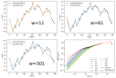

# Diffusivity analysis

Recently Cristian and I start to comparing our trajectory analysis. For this supposedly simple subject, I realize that the treatment to the experimental data, for example the smoothing of trajectories, can have a significant influence on the interpretation.

Despite the importance of this technical aspect of the project, I do not want to include this discussion in the [main note](README.md) because it distract readers from the physics of interest. This seperate note is created for keeping the technical details in the analysis.

## Smoothing trajectories - How much smoothing is enough?

