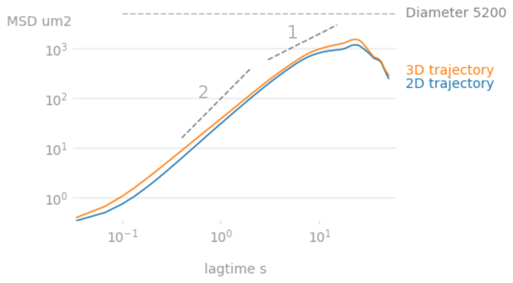
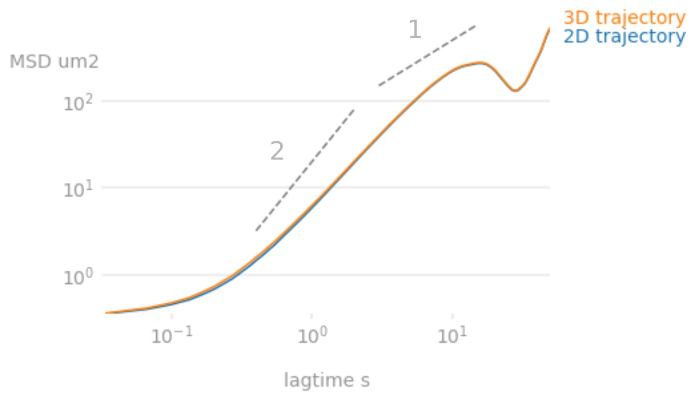
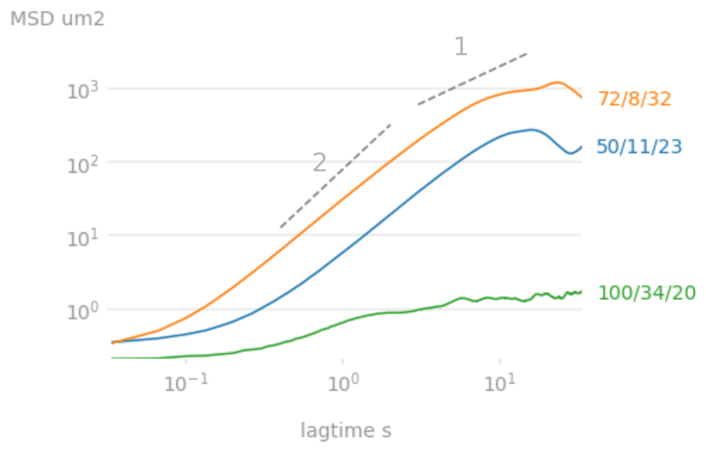

# Diffusivity and Effective Temperature
One objective of DE project is to measure the effective "temperature" of an active bath.

The motion of a passive object provides information about a system.
For example, in [Stokes-Einstein relation](https://en.wikipedia.org/wiki/Einstein_relation_(kinetic_theory)), the diffusivity of a spherical particle through a viscous liquid is a measure of temperature.
Wu and Libchaber (2000) showed that the diffusion of a sphere in bacterial suspensions is much stronger than its Brownian motion.
If the diffusivity is used to calculate the effective temperature, it is ~100 times higher than room temperature.
~~They also observed that a he diffusion coefficient has 1/R dependence on particle size R.~~

Combine this previous knowledge and our DE system, it becomes interesting to see if the size of a confining droplet (the outer droplet) also changes the effective temperature.
To investigate this topic further, we measure the diffusivity of inner droplets of fixed size within confining droplets of various sizes.

## Mean Square Displacement (MSD)

### 2D or 3D
In our double emulsion system, where the inner droplet experiences a buoyant force, the inner droplet motion is not isotropic.
Bouyant force acts as a damping force, making the vertical motion weaker compared to the horizontal motion.
As a result, the 2D MSD (XY motion) and 3D MSD (XYZ motion) are usually very similar.

The figure below shows both the 2D and the 3D MSD of inner droplet in a 72[32]8 (outer[OD]inner, um) system.
The 2 MSD's are very similar in the long time limit.
In the short time limit, however, a slightly larger discrepancy is observed, which is likely due to the manual tracking error.

When the size of inner droplet is larger, the Z motion is even weaker.
In this case, the manual tracking error is smaller and the dominance of XY motion is stronger.
As a result, 2D and 3D MSD's are more similar.
For example, in a 50[23]11 system, the 2 MSD's are hardly distinguishable.

Since Z motion plays little role in the diffusivity, we use 2D MSD for preliminary analysis.

### Droplet Size Effect
The diffusion of inner droplets varies drastically from experiment to experiment.
Potential control parameters are **outer droplet size**, **inner droplet size** and **bacterial concentration**.

So far, 3 sets of control parameters have been tested.
In the figure below, I plot the 2D MSD's of these experiments.

The data show potential concentration-diffusivity and dropsize-diffusivity correlations.
To draw quantitative conclusion, better parameter control is needed.

~~Based on pure observation, smaller droplets move more vigorously. This is to be confirmed.~~
