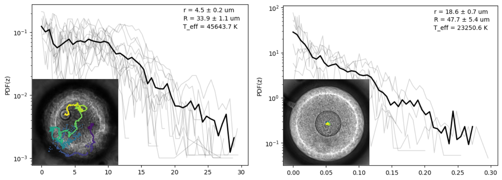
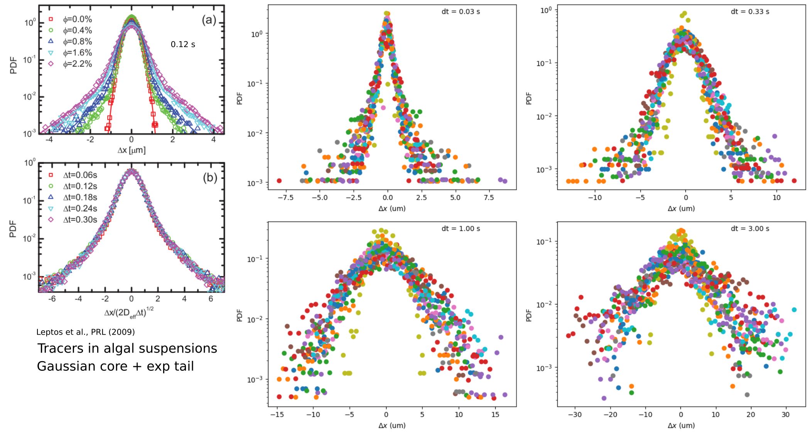
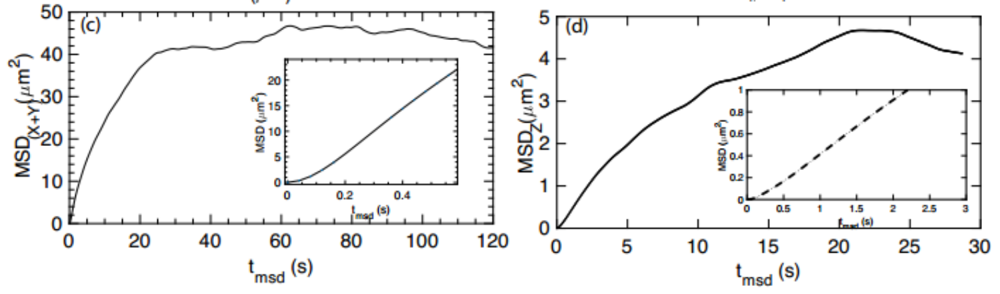

# Diffusivity and Effective Temperature
One objective of DE project is to measure the effective "temperature" of an active bath.

The motion of a passive object provides information about a system.
For example, in [Stokes-Einstein relation](https://en.wikipedia.org/wiki/Einstein_relation_(kinetic_theory)), the diffusivity of a spherical particle through a viscous liquid is a measure of temperature.
Wu and Libchaber (2000) showed that the diffusion of a sphere in bacterial suspensions is much stronger than its Brownian motion.
If the diffusivity is used to calculate the effective temperature, it is \~100 times higher than room temperature.
~They also observed that a he diffusion coefficient has 1/R dependence on particle size R.~

Combine this previous knowledge and our DE system, it becomes interesting to see if the size of a confining droplet (the outer droplet) also changes the effective temperature.
To investigate this topic further, we measure the diffusivity of inner droplets of fixed size within confining droplets of various sizes.

## A Historical Review

### Is Temperature well defined in active systems?

Equilibrium states can be accurately described by a small number of thermodynamic variables, such as temperature and pressure.
In contrast, such framework does not exist for out-of-equilibrium states.
Although "effective temperature" has been already used to describe the enhanced diffusion in active suspensions (Wu 2000, Palacci 2010), the definition of such temperature remains an issue.

**Sedimentation and Effective Temperature of Active Colloidal Suspensions**
[Palacci, PRL (2010)](https://journals.aps.org/prl/pdf/10.1103/PhysRevLett.105.088304)

Effective temperature increases quadratically with particle self-propulsion velocity.

**Effective temperature of a single active particle**
[Szamel, PRE (2014)](https://journals.aps.org/pre/pdf/10.1103/PhysRevE.90.012111)

- Free particle effective temperature determines the stationary state distribution in the presence of a linear potential, but does not for a quadratic potential.
- Equilibrium dynamics give Gaussian stationary state distribution. Non-Gaussianity measures the extent of out-of-equilibrium.

**Driven Brownian particle as a paradigm for a nonequilibrium heat bath: Effective temperature and cyclic work extraction**
[Wulfert, PRE (2017)](https://journals.aps.org/pre/abstract/10.1103/PhysRevE.95.050103)

> A nonequilibrium FDR may depend on both time and the choice of observable...effective temperature acquires thermodynamical meaning only if these dependences are not too pronounced...

For example, in glassy systems, the structural relaxation and local vibration time scales are well separated. If we measure the temperature of the system at different time scales, we may obtain different results.

One way of dealing with time dependent properties is to only consider time-integrated quantities. Alternatively, one can regard effective temperature as a spectral quantity.

**Generalized Energy Equipartition in Harmonic Oscillators Driven by Active Baths**
[Maggi, PRL (2014)](https://journals.aps.org/prl/pdf/10.1103/PhysRevLett.113.238303)

- Experiment studying the dynamics of beads in active suspensions confined by a harmonic potential, focusing on the generalized energy equipartition.

> A harmonic degree of freedom contributes an average potential energy that takes the equilibrium form for small curvatures and decreases when the relaxation time in the harmonic well starts to be comparable to the persistence time of active forces.

- Relaxation time in harmonic well vs. persistence time of active force: a useful time scale comparison

**How Far from Equilibrium Is Active Matter?**
[Fodor, PRL (2016)](https://journals.aps.org/prl/pdf/10.1103/PhysRevLett.117.038103)

> At short time and space scales, the persistent motion of active particles typically precludes the existence of effective temperatures, while at larger scales, FDTs can sometimes be recovered.

> For instance, motility-induced phase separation (MIPS), which leads to the liquid-gas coexistence of repulsive self-propelled particles, is not associated to the emergence of steady-state mass currents.

- Large time scale allows the use of FDT, consistent with [Wulfert, PRE (2017)](https://journals.aps.org/pre/abstract/10.1103/PhysRevE.95.050103).

**Comments:** Literature points out that FDT can be recovered at larger time scales.

### Understand the motions of probes

**Rapid-prototyping a Brownian particle in an active bath**
[Park, Soft Matter (2020)](https://pubs.rsc.org/en/content/articlepdf/2020/sm/d0sm00828a)

> while experimentally the probability distribution functions of particle position and displacement in bacteria systems are Gaussian in some studies and non-Gaussian in others, the relevant differences of experimental conditions are unclear and analysis is problematical.

- The Gaussianity of PDF has long been an indicator of equilibrium in dynamical systems. While active suspensions are non-equilibrium systems, probes in them sometimes show Gaussian PDF. This paper suggests that the non-Gaussianity is not a necessary consequence of an active bath, but depends on the relative time scales of "active kick" and the "interval between kicks"
- The idea is interesting but hard to validify in bacterial systems.

## Probability Density Functions (PDF)

We measure the statistics of inner droplet motions, including z position PDF and displacement PDF, to get effective temperature.
These PDFs will also tell us how much the system deviates from equilibrium.

### Z Position PDF

Think of the inner droplet as a molecule in gravitational potential in z direction.
The z position PDF takes **Boltzmann distribution**: P(z)=P0*exp(-E/kT), where E is the potential energy of a certain state (z).

The figure below shows the PDF(z) of "small" (left) and "big" (right) inner droplets.
Thinner gray lines are different runs of experiment and thicker black lines are the averages.
The insets show the photos of the double emulsions, as well as the trajectories of the inner droplets.
Two observations: (i) PDF(z) of "big" inner droplet is more similar to Boltzmann distribution; (ii) the effective temperature (obtained by fitting the PDF with linear function) is on the order to 10^4 K.

### Displacement PDF

Non-Gaussianity is a characteristic of displacement PDF of tracers in active bath (Leptos 2009).
I measured the displacement PDF of small inner droplets (r = 4.5 um).
~I don't know how to interpret these PDF since they result from combined effects of active stress and buoyancy potential.~

## Mean Square Displacement (MSD)

### 2D or 3D
2D MSD (XY motion) and 3D MSD (XYZ motion) are usually very similar, because the motion in z is much weaker than in XY.
This is consistent with the results from Cristian, as shown below.

### Droplet Size Effect
The diffusion of inner droplets varies drastically from experiment to experiment.
Potential control parameters are **outer droplet size (R)**, **inner droplet size (r)** and **bacterial concentration (n)**. These parameters are indicated in the legend as R/r[n]

So far, 3 sets of control parameters have been tested.
In the figure below, I plot the 2D MSD's of these experiments.

The data show potential concentration-diffusivity and dropsize-diffusivity correlations.
To draw quantitative conclusion, better parameter control is needed.
