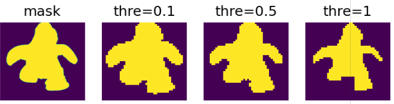
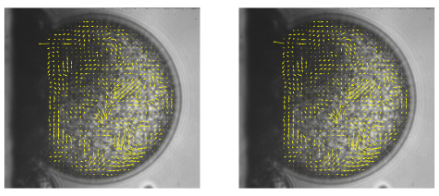
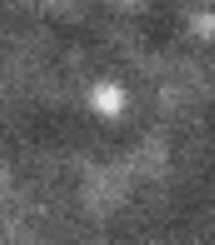
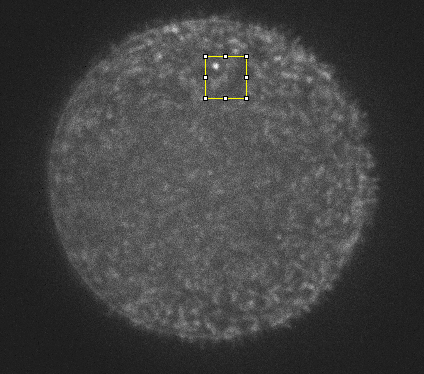
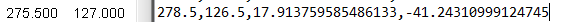
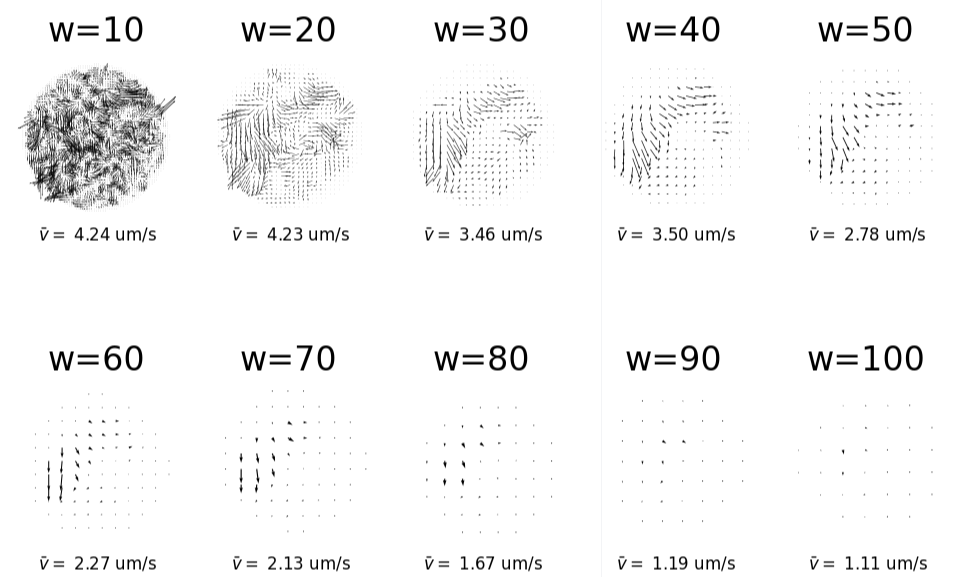
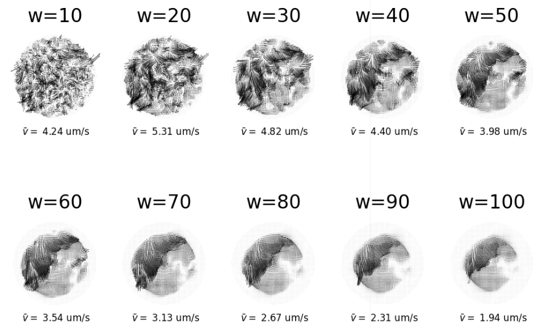

# PIV Technical Report

()

Particle image velocimetry is a powerful flow analysis and visualization technique. To get the most useful information out of it, we need to deal with some technical details, including choosing the best parameters and check the validity of the analysis. In this report, I deal with these aspects of applying PIV on bacterial flows in droplets. Portions of this report were originally written in [the collective motion in droplets note](Analysis_of_collective_motions_in_droplets.md).

## I. Masked PIV

**The need for masked PIV arises from the study of bacterial flow field in droplets.** Unlike previous bulk experiments, where the whole field of view is filled with bacteria, the images I have now usually have all bacteria confined in parts of the images. The followings are typical images I obtained recently, with one or more droplets in each image.


The first image is a bright field image of a double emulsion in the XZ plane (gravity pointing to the left). The boundary is not very clean so that the left boundary of the droplet does not show completely. The second image is a confocal image of several small droplets. The third image is a bright field with a cleaner boundary, so that even the left edge can be seen clearly. The fourth droplet is the confocal image of the same droplet in the third image.

### A. Masking method

#### 1. Rectangle + circle
Initially, I came up with a two-step masking scheme to deal with images like the first image. Specifically, step one is to apply a rectangular region of interest bonding the droplet (red rectangle); step two is to specify the center position and radius of the droplet (yellow circle). This scheme is illustrated in the following sketch.


Following this masking procedure, PIV analysis is performed in the rectangular ROI, and only the velocities inside the yellow circle are kept as valid velocities.

#### 2. Flexible mask

**In images with more complicated morphological features, more flexible masks are required.** For example, when there are multiple droplets in one image, the Rectangle + circle method is not sufficient. **In this scenario, I can manually draw a mask image in ImageJ based on the raw image, and pass this image to PIV algorithm as a mask.** An example is shown below.


This mask can then be used with the function `PIV_masked()` in `pivLib`, by passing the mask image as an argument. As an example, we test `PIV_masked()` on above left image (image 2), with the right image as the mask image, by running
```python
x, y, u, v = PIV_masked(I20, I21, 20, 10, 0.02, mask2)
```
As can be seen in the result below, yellow PIV arrows are found in both big droplets. The small droplet is smaller than the PIV box size, so no velocity is detected there.


**Moreover, this method makes it possible to apply masks with arbitrary morphologies (not just circles).** For example, I made a freehand drawing as shown in the left panel below and use it to mask the velocity field in the middle panel. The resulting masked velocity field is plotted on top of the mask in the right panel.


It may be noticed that for the masked PIV in the images above, there is a gap between the mask contour and the PIV arrow contour. This gap is caused by the way I convert the pixel mask into PIV window mask. **There is a threshold setting in this process, determining what kind of windows are considered "transparent" and what windows are considered "opaque" in a mask.** In code, this thresholding is implemented as the following:
```python
mask_w = divide_windows(mask, windowsize=[winsize, winsize], step=winsize-overlap)[2] >= 1
```
Setting threshold to 1 leads to the most conservative mask (smallest transparent region), which causes the gap between the contours. To close the gap to include more velocities in the mask, simply set the threshold to 0.5. The figure below illustrates the effect of the threshold.


### B. Masking procedure

There are several ways to use the mask. To mask the raw images before applying PIV or to mask the final velocity result, or to do both. How much do these options affect the final result of the PIV analysis? We test the following procedures:

1. Mask raw images by setting background 0, then apply PIV.
2. Apply PIV directly on raw images, then apply mask on velocity.
3. Mask raw images by setting background nan, then apply PIV. (PIV algorithm does not support nan pixels for the moment, so this cannot be tested yet).

The test code can be found in `Masked_PIV.py`. Use Hydrogen to view the results by `Run all`.

**In conclusion, the two procedures produce very similar results, except that procedure 1 runs a little bit faster.**

Below are some plots comparing the overall velocity field, velocity PDF and running speed:

- overall velocity



- velocity PDF


- running speed


## II. Validity of PIV analysis

### A. Visual inspection

**So far the best way to validify PIV analysis is visual inspection.** Such inspection is two-fold. First, we can compare hand measured velocity with PIV results quantitatively. This can be done for a few frames, and doing it for all the data is unfeasible. _Actually, that's why we use PIV, because it's more efficient with large data set._ Second, we can plot PIV arrows on top of corresponding images and see roughly if the directions and magnitude make sense.

#### 1. Make overlay movies
**A python function `matplotlib.pyplot.quiver(...)` is used to plot the velocity field of PIV.** By default, `quiver` automatically determines a proper scale for each velocity field. This is kind of similar to the contrast autoscaling for images, which makes sure that an image is not too dark or too bright, and patterns can be seen. **While autoscaling is always good for a single image, for a video with many frames it's better to fix the scale, because a direct feeling of relative magnitude is important in a dynamic process.** For example, if we fix the light intensity scale, we will know if the overall light intensity changes from one frame to another.

**`quiver` provides a "complicated" method to control the scale, by combining keywords `scale` and `scale_units`.** `scale` is the number of data units per arrow length unit, e.g., m/s per plot width. `scale_units` is the arrow length unit, and can be `{'width', 'height', 'dots', 'inches', 'x', 'y', 'xy'}`. See the [official document of `quiver`](https://matplotlib.org/stable/api/_as_gen/matplotlib.pyplot.quiver.html) for more detailed information. **In the `piv_overlay.py` script, we have access to the PIV data information and the output image information.** We know the how many arrows we are going to plot, on what height and width. We want the arrows to be large so that we can see them clearly. We also don't want to make them too large to block other arrows. A good choice of maximum arrow length is the PIV box size, i.e. width / ncol. **To set this, we let `scale_units='width'`, and let `scale=max(u.max(), v.max()) * ncol`.** The interpretation of this setting is: the largest velocity component has length of width / (number of columns). Note that this only needs to be set once for an image sequence. From the second PIV data, we use constant `scale`.

In order to make PIV movies more visually appealing, I sometimes plot less arrows and make the arrows larger. This is implemented through the `sparcity` argument of the `piv_overlay` script. If `sparcity` is set to any value that is not 1, the scale of all arrows should be modified, too.

**Qualitatively, the arrows point to the same direction as the motions.** <font color='red'> Link to piv overlay of 22 </font> The reason why the mean velocity is small could be that the velocity in the interior of droplets are in general small. The following animation is a pair of adjacent frames sampled from my data. On the right is the velocity field from PIV analysis.

 

#### 2. Manually measure velocity

**Quantitatively, we can manually measure the displacement of certain image elements and compare it with the PIV data.** In the example image above, for example, there is a bright spot in the upper middle of the droplet, which is moving down and a little to the right. A zoom in view of the motion is shown below. The red line in the second frame indicates the displacement of the bright spot (~4.9 px) over 2 frames (0.04 s), the instantaneous velocity can be calculated as $4.9/0.04=102$ px/s.



Now we look at the PIV data.



The center of the yellow box above is measured to be 275, 127. The closest PIV box is at 278.5, 126.5. The velocity is $\sqrt{17.9^2+41.2^2}=44.9$ px/s. **Although this is smaller than the manual measurement (102 px/s), the factor of 2 difference is acceptable.** We only measure the displacement of a specific spot, whereas PIV measures the displacement of a box. So it makes sense that the average displacement is lowered by the pixels around the bright spot.


### B. Window size effect
**Window size (more formally interrogation window size, $w$) is arguably the most important parameter in a PIV analysis.** In principle, it should be large enough to contain many moving particles, so that the correlation functions of images indicate the displacement of particles. On the other hand, it should be much smaller than the velocity field structure, so that the structure of interest won't be averaged out. **Usually, there is a range of window size, within which PIV analysis always give consistent results.** In this section, we seek such range by exploring different window sizes (and overlap).
#### 1. Fix overlap as half window size
Typically, I fix the overlap as half of the window size. In this test, I vary the window size from 10 px to 100 px (1 px = 0.16 um). The resulting velocity fields are summarized in the figure below.



**The velocity fields of $w=10$ and $w=20$ look very similar and their mean velocities are almost the same! This is indicative that 10-20 is the "sweet range" of PIV on this image set. Above 20, however, the results seem to lose important velocity structures due to over averaging.** Actually, most outstanding velocity features persist up to $w=40$.

I also plot the velocity probability density function (PDF) of the PIV data above. When $w\le20$, PDF's have similar shapes. When $w>20$, the large velocity tails drastically fall down, again indicative of over averaging.


#### 2. Fix distance between arrows

In the previous section, we notice that as the window size increases, the number of arrows decreases. As a result, we only have 34 arrows when $w=100$. This small number of arrows may lead to a lack of statistics issue. To make all the number of arrows consistent throughout all the window sizes, I set `overlap` to be $w-5$. Below is the resulting velocity fields.



**Now it's clear that lacking statistics is not what makes the PIV inaccurate. Rather, it's the box size that is causing over averaging errors.** Similar conclusion is drawn from the PDF's.


**According to this test, I will use $w=20, o=10$ as an empirical rule of thump (for 40x lens).**

### C. PIV on bacteria directly: is this a justified method?

**Using bacteria directly as tracer particles for PIV is still not well accepted by the community**, according to my experience with the previous two papers (Science Advances 2021 and Soft Matter 2021). We've got questions from reviewer, e.g. does PIV works well when some bacteria in the interrogation window are moving much faster than the mean velocity? What is being measured in PIV when there is a strong inhomogeneity of velocity? **However, PIV on bacteria, or more generally active swimmers, has been used by many previous studies, too.** See refs 1-8 for examples. **In addition, we have tested PIV algorithms on some simulated images, and obtained results very close to the ground truth.** Two scenarios are tested: i) objects moving in random directions with 0 mean velocity; ii) objects moving in the same direction with different velocities. **Lastly, using the PIV method, we can determine the critical transition conditions, which are consistent with independent measurements from our aspects (e.g. tracer diffusion).** With these, we hope to convince the readers that PIV using bacteria as tracers is a valid experimental method.

### D. Zero control

**To assess the uncertainty of the PIV algorithm, I take a video of a "frozen" bacterial droplet and apply PIV on it.** As suggested by the description "frozen", the bacteria inside the droplet barely move. Therefore, the expected velocity is zero. _This is why I call this test a zero control._ The full video can be found [here](remember_to_put_the_link). You can also find a low frame rate animation below. (Scharnowski, S. & Kähler, C. J. Particle image velocimetry - Classical operating rules from today’s perspective. Optics and Lasers in Engineering 135, 106185 (2020).)

The mean velocity of the zero control video is shown in the following plot. The mean velocity is not exactly zero, due to both detection error and the tiny fluctuations of the droplet. **However, compared to the mean velocity of bacteria in a typical active droplet (2.6-3.2 um/s), the mean velocity of this frozen droplet (0.5 um/s) is noticeably smaller.** I will consider 0.5 um/s the magnitude of the detection error of PIV.


## III. Compare PIV on bright field images and confocal images

<font color="blue">Part of this has been done in the mean velocity analysis note. However, this comparison needs to be more detailed, so that we know if the two methods gives qualitatively similar results. For example, are they different only by a fixed factor of magnitude, or there are more qualitative difference? PDF, videos of PIV will be compared.</font>

### A. PDF

We have plotted the velocity PDF at certain times. Here, we are going to measure one velocity PDF for a whole video. The figure below compares the PDF's from the velocity fields measured from bright field and confocal images of the same sample. Velocities in x and y directions (u and v) are plotted in different colors. **The data show that within the same set of images, u and v are quantitatively same. Compared to bright field velocity filed, confocal velocity field shows a higher peak at 0, less intermediate velocities and more large velocities.**


   

### B. Overlay videos

[bright field](https://drive.google.com/file/d/132kTJJ2wTKtgHLtIFhKINGsCcij0oJLa/view?usp=sharing)

[confocal](https://drive.google.com/file/d/1TnInrxeBi5kC55qGfrtzvur9o2QRKV_g/view?usp=sharing)


<!--  -->
