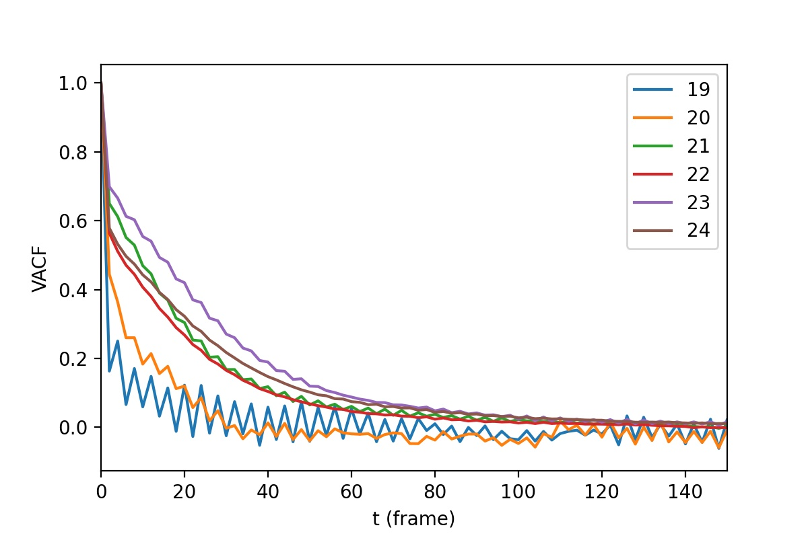
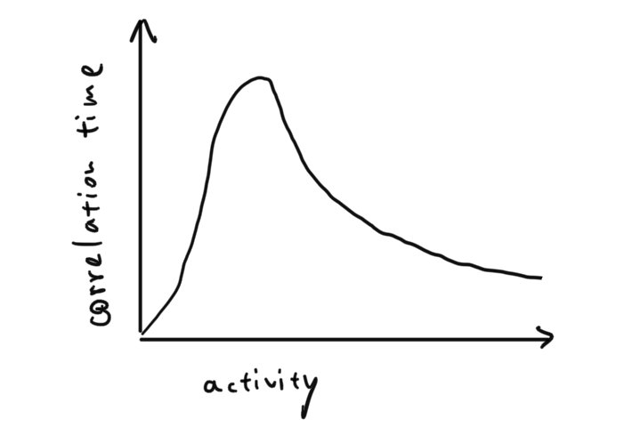

# PIV velocity autocorrelation function

In this note, we visualize the velocity autocorrelation function (VACF) of PIV velocities in droplets. The VACF data from PIV can potentially be compared with those of tracking inner particles or droplets. This note should be read in pair with code `PIV_velocity_autocorrelation.py`.

From the plot, the first intuition to get is: noisy motion has autocorrelations that decay faster. The most active bacterial sample in the 12092021 experiment is sample 4. The VACF of all the videos from sample 4 is shown below.

  Sample 4: OD=130, no MB, 2400 xg centrifuge, room temp
  19. sample 4, BF
  20. fluo 19 :: small drop
  21. sample 4, BF, xz, DE :: small inner, good image qual and activity
  22. fluo 21
  23. Same DE as 21, 22, BF :: Take videos of this DE until it's dead
  24. fluo 23

19 and 20 are from the same very small drop (d=20 um), 19 being bright field images and 20 being confocal images. 21-24 are from the same larger droplet (d=55 um). Below is a preview of 19-24.

The VACF curves roughly fall into two groups for two different droplets, whereas bright field and confocal images remain mostly indistinguishable. This is indicative of the validity of using bright field images for PIV analysis. Of course, the comparison between bright field and confocal PIV needs more data, such as mean velocity, velocity distribution and most importantly, a direct visual inspection to make sure the two imaging technique can give same PIV results.

The interpretation of long correlation time can be two-fold. One the one hand, strong collective motion (high activity) leads to long correlation times than random motions. One the other hand, a slower but still collective motion can exhibit even longer temporal correlations. Therefore, in a dense bacterial suspension, if we make a plot of correlation time vs. bacterial activity, the curve would be nonmonotonic, but shows a peak with two decaying tails, as illustrated below.

The peak may diverge. I observed similar thing in the GNF study. In a droplet, the measurement could be done in a easier and more convincing way, since we can always image the same batch of bacteria, and their activity decays with time. 
