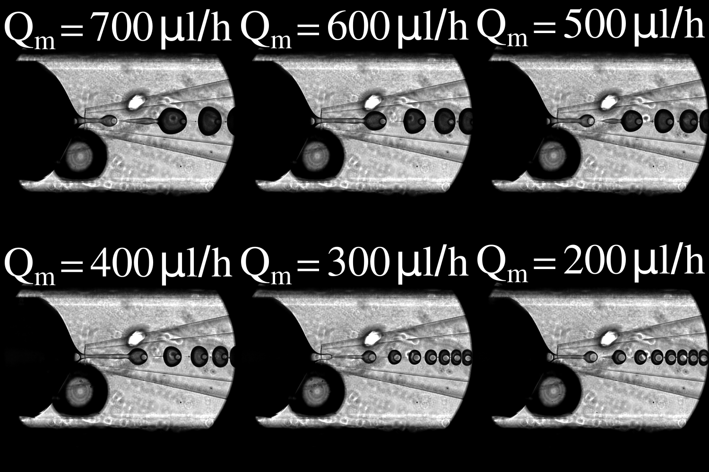
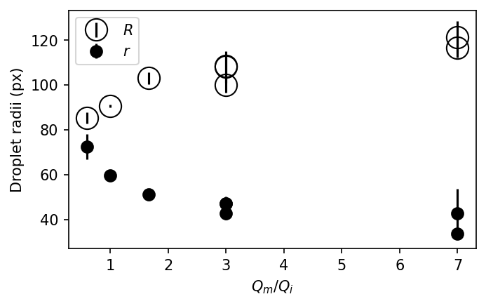
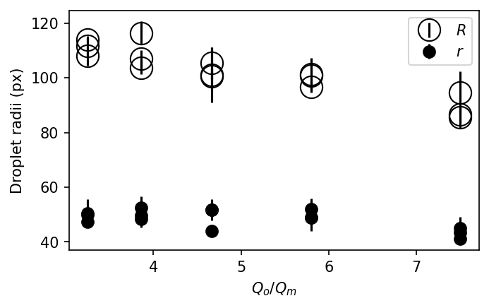

# Droplet Size Control
In this project, we want to explore how the size and curvature affect the dynamics of bacterial suspensions.
Producing droplets with desired sizes is of key importance for this project.
The figure below illustrate the controllable sizes of inner and outer droplets.

## Hypothesis
Utada et al. (2005) suggests that the ratio between Q_o and Q_i determines the size of outer droplets.
Here, Q_i is the sum of middle and inner phase flow rates.
As a hypothesis, if I keep Q_o and Q_i constant, and vary the ratio between middle and inner flow rates, I can obtain constant outer size and varying inner size.
Constant inner size with varying outer size can be achieved similarly.

## Experiment
The hypotheses have been tested in experiment (07132021) and the results are presented below.

Let's first try to keep outer size constant.
Q_o is 1000 ul/h and Q_m + Q_i is 400 ul/h.
The ratio between Q_m and Q_i ranges from 0.6 to 7.
Inner (solid, r) and outer (empty, R) sizes are shown in the plot below.

The outer size is not constant.
The inner size indeed decreases.

We then try to keep inner size constant.
Q_o + Q_m is 1700 ul/h and Q_i is 100 ul/h.
The ratio between Q_o and Q_m ranges from 3.25 to 7.5.
Inner (solid, r) and outer (empty, R) sizes are shown in the plot below.

The inner size is roughly constant.
The outer size indeed decreases.
