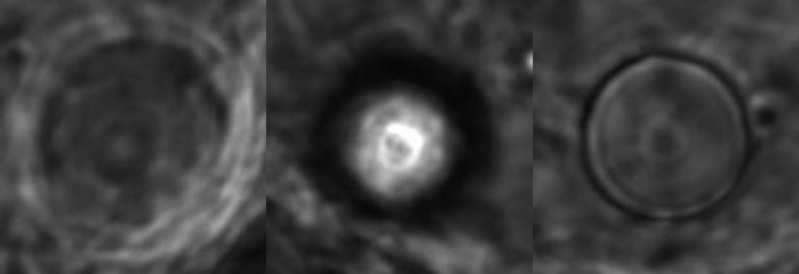
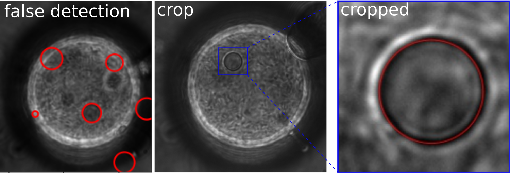
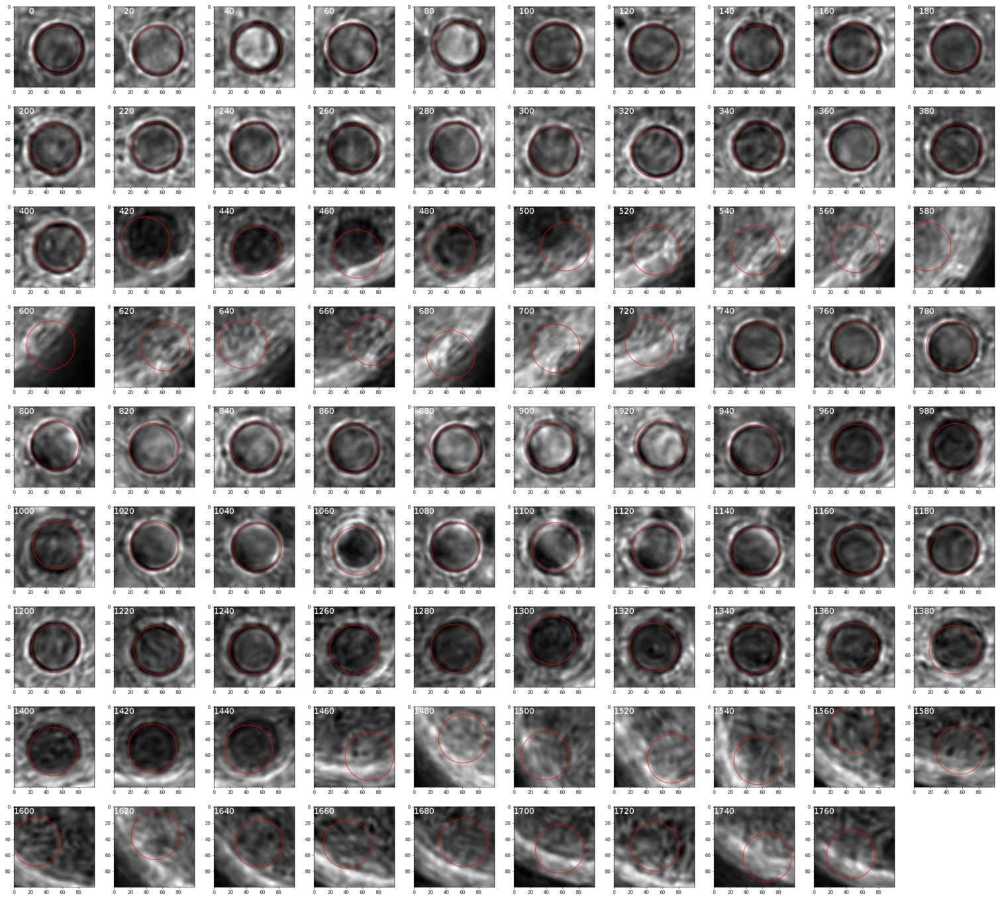
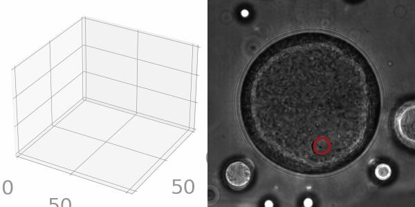

# Droplet Tracking

## Content
- X-Y plane tracking
  - corrTrack  
  - HoughCircles
- Z tracking
  - manual tracking with piezo system
  - confocal

## X-Y plane tracking
### corrTrack
*corrTrack* proves to be not ideal for tracking droplets in X-Y plane.
*corrTrack* requires that the object in all images look similar.
However, our droplet looks very different when it is in and out of focus, as evident in the picture below.

The vigorous motion results in frequently going in and out of focus.
Therefore, *corrTrack* is not feasible for tracking these droplets.
I notice, however, that the droplets **always appear as circles**.
A circle detection method -- HoughCircles may be useful.

### HoughCircles
The *HoughCircles* algorithm detects circular objects in images based on pixel intensity gradient.
Compared to *corrTrack*, *HoughCircles* has more relax criteria for determining objects.
Although *HoughCircles* can usually detect the inner droplets, it also returns many false positives.
To overcome this challenge, I crop the original images so that the inner droplets make up the majority of the cropped images.
By setting the `minDist` (the minimal distance between detected circles) larger than the cropped image, *HoughCircles* is forced to detect at most one circle.
This idea is illustrated in the figure below.

The *crop-HoughCircles* method is tested on a sample image sequence, the results are shown below.

In most images, the inner droplet is successfully detected.
In some images, however, the method works poorly.
There are two possible problems that may cause the poor performance:
- the cropping region does not contain the object
- the image quality is too low for *HoughCircles* to detect a circle

The "cropping region" problem can be solved by manually setting cropping region, where inner droplets are visible but cropping regions are off.
The "image quality" problem cannot be solved within the framework of *HoughCircles* method, but the tracking can be complemented by manual tracking.

## Z tracking
### Manual tracking with piezo system
This method adopts the same principle as the bacteria tracking system.
The only difference is that the bacteria tracking system is automatic, whereas the droplet needs to be manually focused.
The animation below illustrate the 3D trajectory obtained by combining *crop-HoughCircles* and *manual tracking*.

### Confocal
~~To be continued~~
