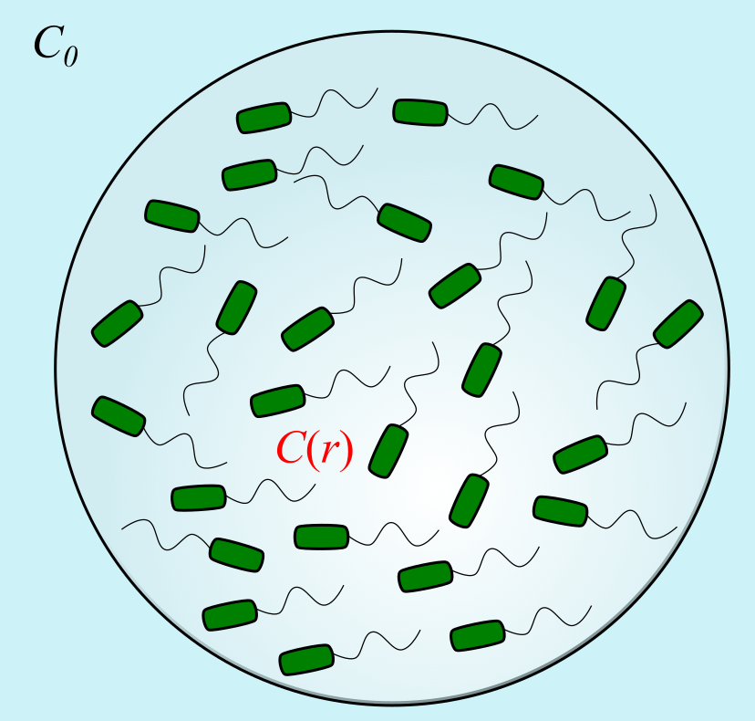
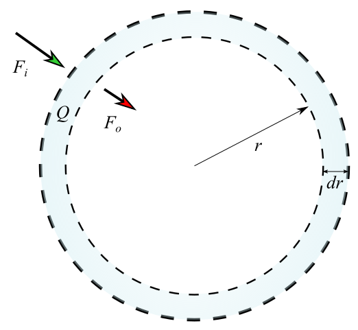

# Oxygen diffusion calculation

In this note, I calculate the oxygen concentration profile inside a water droplet (bacterial suspension) immersed in oil (hexadecane).

For simplicity, let's first assume oxygen transport is purely diffusion, with diffusivity $D$. We also assume the oxygen concentration in the oil phase to be constant $C_0$, and inside the droplet it is a function of radial position $C(r)$. Each bacterium consumes oxygen at a fixed rate, known to biologist as oxygen uptake rate (OUR). Let's take the maximum value reported in Riedel et al. 2013: $q=10^{-6.7}$ umol CFU$^{-1}$ day$^{-1}$. Bacterial number concentration is $n = 8\times 10^{10}$ ml$^{-1}$. The radius of the droplet $R=50$ um.

Let's focus on a spherical shell in this droplet, as sketched below.

Oxygen enters and leaves the shell through diffusion, at rates $F_i$ and $F_o$. The bacteria inside the shell are also consuming oxygen, at a rate $Q$. Therefore, the total rate of change of oxygen amount in the shell can be formulated as

$$
V\frac{dC}{dt} = F_i - F_o - Q
$$

where
$$
F_i = - 4\pi (r+dr)^2 D \frac{dC}{dr}|_{r+dr} \\
F_o = - 4\pi r^2 D \frac{dC}{dr}|_{r} \\
Q = nVq
$$
Here, $V=4\pi r^2dr$ is the volume of the shell. Write together and set the system to steady state, we have

$$
\frac{dC}{dt} = -D \frac{1}{r^2}\frac{d}{dr}(r^2\frac{dC}{dr}) - nq = 0.
$$

To make the equation dimensionless, let $\tilde C = C/C_0$ and $\tilde r=r/R$. The equation we are going to solve is

$$
-\frac{1}{\tilde r^2} \frac{d}{d\tilde r}(\tilde r^2 \frac{d\tilde C}{d\tilde r}) = K
$$

where $K=\frac{nqR^2}{DC_0}$ is the dimensionless control parameter of the process.
## References
Riedel, Timothy E., William M. Berelson, Kenneth H. Nealson, and Steven E. Finkel. “Oxygen Consumption Rates of Bacteria under Nutrient-Limited Conditions.” Applied and Environmental Microbiology 79, no. 16 (August 2013): 4921–31. https://doi.org/10.1128/AEM.00756-13.
