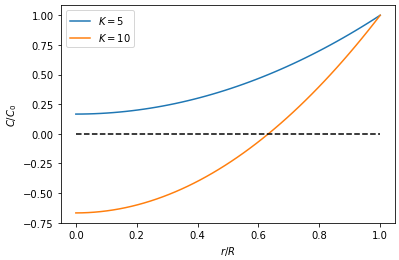
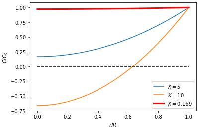

# Oxygen diffusion calculation

In this note, I calculate the oxygen concentration profile inside a water droplet (bacterial suspension) immersed in oil (hexadecane).

## I. General derivation

For simplicity, let's first assume oxygen transport is purely diffusion, with diffusivity $D$. We also assume the oxygen concentration in the oil phase to be constant $C_0$, and inside the droplet it is a function of radial position $C(r)$. Each bacterium consumes oxygen at a fixed rate, known to biologist as oxygen uptake rate (OUR, $q$).

Let's focus on a spherical shell in this droplet, as sketched below.

Oxygen enters and leaves the shell through diffusion, at rates $F_i$ and $F_o$. The bacteria inside the shell are also consuming oxygen, at a rate $Q$. Therefore, the total rate of change of oxygen amount in the shell can be formulated as

$$
V\frac{dC}{dt} = F_i - F_o - Q
$$

where
$$
F_i = 4\pi (r+dr)^2 D \frac{dC}{dr}|_{r+dr} \\
F_o = 4\pi r^2 D \frac{dC}{dr}|_{r} \\
Q = nVq
$$
Here, $V=4\pi r^2dr$ is the volume of the shell. Write together and set the system to steady state, we have

$$
\frac{dC}{dt} = D \frac{1}{r^2}\frac{d}{dr}(r^2\frac{dC}{dr}) - nq = 0.
$$

To make the equation dimensionless, let $\tilde C = C/C_0$ and $\tilde r=r/R$. The equation we are going to solve is

$$
\frac{1}{\tilde r^2} \frac{d}{d\tilde r}(\tilde r^2 \frac{d\tilde C}{d\tilde r}) = K
$$

where $K=\frac{nqR^2}{DC_0}$ is the dimensionless control parameter of the process. Using no-flux boundary condition at the center of the droplet and concentration $C_0$ at the droplet surface, we obtain

$$
C(r) = [1 - \frac{K}{6}(1-\frac{r^2}{R^2})]C_0.
$$

Now we have an expression for oxygen concentration as a function of $r$. However, notice that this does not always give realistic concentration profile, depending on the value of $K$. For example, the following plot shows the oxygen profiles when $K=5$ and $K=10$.

The contrast is when $K=5$, $C>0$ always hold. But when $K=10$, $C$ reaches 0 when $r/R\approx0.6$, and is surely unrealistic. To understand the oxygen concentration profile better, we need to evaluate the control parameter $K$.

## II. Evaluate K
$$K=\frac{nqR^2}{DC_0}$$
Bacterial number concentration in a typical experiment is $n = 8\times 10^{10}$ ml$^{-1}$. The radii of droplets $R\sim50$ um. For the oxygen consumption rate, let's take the maximum value reported in Riedel et al. 2013: $q=10^{-6.7}$ umol CFU$^{-1}$ day$^{-1}$. The diffusivity of oxygen in water is $2.11\times 10^{-5}$ cm$^2$/s (Ju et al. 1989). Assume $C_0=1.298\times 10^{-3}$ mol/L, the saturate concentration of oxygen in water under atmosphere pressure. Taken together, we have $K\approx0.169$. In the following figure, I plot the estimated oxygen profile under these conditions as the red curve. **It turns out that for a small droplet, when surface oxygen concentration is high enough, diffusion is sufficient to keep a almost constant oxygen concentration throughout the whole droplet.** However, as $C_0$ decreases, $K$ will increase and eventually result in a more noticeable oxygen gradient, as in the $K=10$ case.

Moreover, in real experiment, oxygen transport is not pure diffusion, but rather dominated by the flow generated by the collective motions of bacteria. How to consider this in to the transport equation remains an open question.

## References
Riedel TE, Berelson WM, Nealson KH, Finkel SE. 2013. Oxygen Consumption Rates of Bacteria under Nutrient-Limited Conditions. Appl Environ Microbiol. 79(16):4921–31

Ju L-K, Ho CS. 1989. Oxygen diffusion coefficient and solubility in n-hexadecane. Biotechnology and Bioengineering. 34(9):1221–24

<!--  -->
