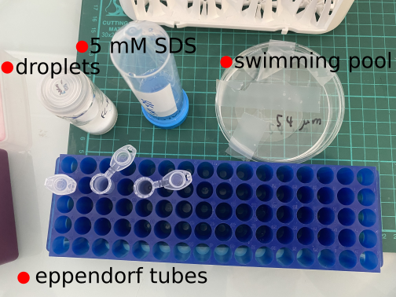
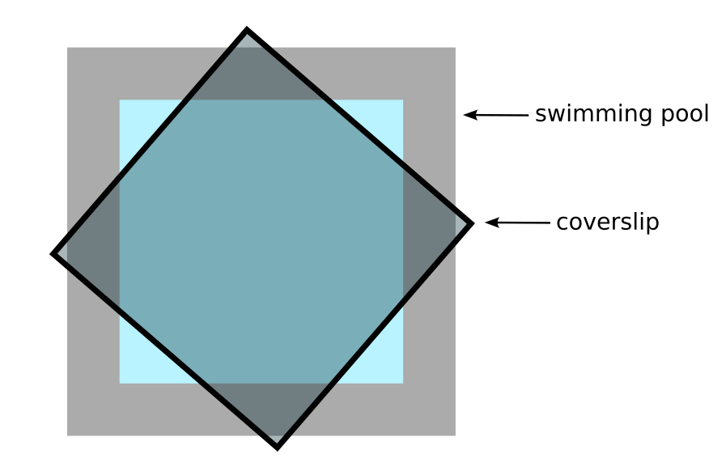
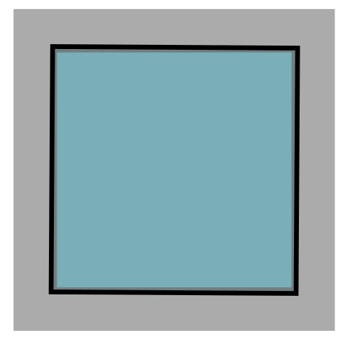
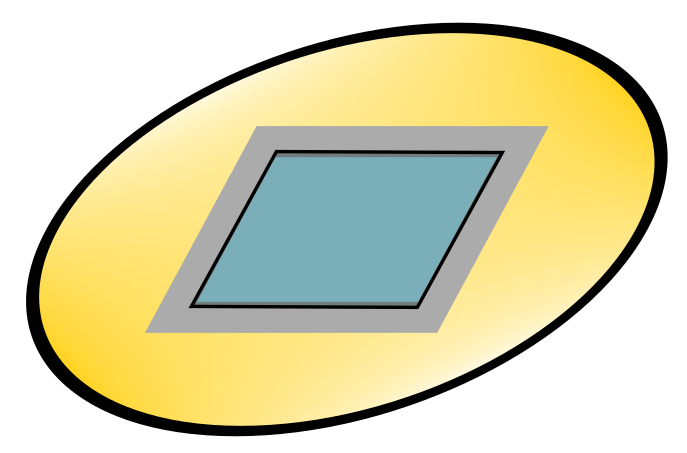

### Protocol: bacteria in porous media

This protocol describes the motility assay of _E. coli_ in 2D porous media.

##### 1. Ingredients

- Fluorinert FC-40 oil droplets (3 $\mu$m and 10 $\mu$m in diameter)
- 5 mM SDS solution
- swimming pool 54 $\mu$m height
- several 1.5 ml eppendorf tubes
- 18 mm x 18 mm glass coverslips
- AD62 (or AD63) bacterial culture

##### 2. Protocol

**Prepare bacteria-droplet mixture**

_Note: numbers are for 3 (10) $\mu$m droplets_

1. Transfer 195 (170) $\mu$l SDS solution to an eppendorf tube.
2. From the big droplet vial, transfer 5 (30) $\mu$l droplets to the SDS solution.
3. Mix well by stirring with a pipette tip.
4. Transfer 180 $\mu$l droplet suspension to another eppendorf tube.
5. Transfer 20 $\mu$l bacterial suspension (OD $\approx 0.2$) to the droplet suspension (final OD $\approx 0.02$).
6. Now we have 200 $\mu$l of bacteria-droplet mixture.

**Load mixture to the swimming pool**

1. Carefully press and spread 100 $\mu$l mixture on the bottom substrate of the swimming pool, make sure to cover all the surface.
2. Cover the coverslip at a 45$^\circ$ angle, to avoid trapping air bubbles in the pool.

3. Move the coverslip to cover the whole pool.

**Imaging - confocal**

1. We use the confocal microscope at Gulliver lab to image. Set the focal plane at the equatorial plane of the droplets sitting on the bottom substrate.
2. Set exposure time to 100 ms.
3. Use blue laser of intensity 30-50%.
4. In Ti Pad tab, turn off the bright light lock and adjust bright light so that we can see both droplets configuration and fluorescent bacteria.
5. Take videos of 3000 frames each using Fast Time Lapse (5 min videos).

**Imaging - two color**

Refer to Eric lab's handbook.

#### Appendix

##### A. Porous media preparation

The porous media used in this experiment are mono-dispersed droplets of Fluorinert FC-40 (an immiscible fluorocarbon oil). The density of FC-40 is 1.85 g/ml, so it sediments in water due to gravity. 5 ml FC-40 is pressed through a porous membrane to 20 ml SDS solution (5 mM), forming a dense droplet suspension.

##### B. Swimming pool details

- The bottom substrate is 2-inch circular borofloat glass wafer, 500 $\mu$m thick.
- The square wall is made by photoresist SU-8 2050 (Microchem). Outer side length is 20 cm, while inner side length is 15 cm.
- The pool height is 54 $\mu$m.

