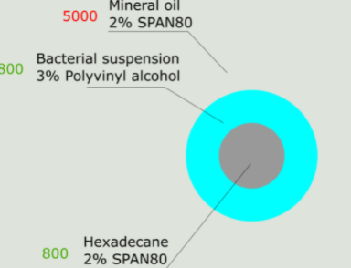
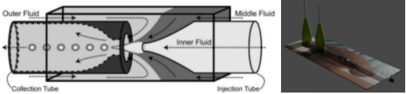
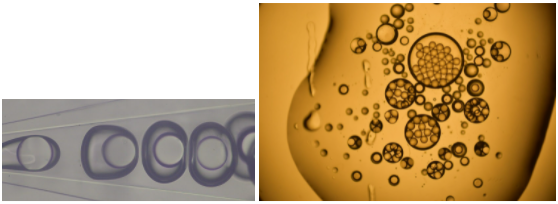

# Confine bacteria in double emulsions - Microfluidics

Need revision

This document describes the procedures of confining bacteria in double emulsions. Such emulsion is essentially an aqueous shell sandwiched between two oil phases. The geometry of an emulsion droplet is illustrated in the picture below:

## Background

The emulsion is a O1/W/O2 double emulsion. O1 is the outer oil phase, for which we use mineral oil, supplemented with 2% SPAN80 surfactant. W is the aqueous phase, for which we use bacterial suspensions supplemented with 3% polyvinyl alcohol. O2 is the inner oil phase, for which we use hexadecane supplemented with 2% SPAN80 surfactant.

The microfluidic device is a glass capillary tube based 3D microfluidic device, first designed by Utada et al. (Science 2005) to produce monodisperse double emulsions (see illustrations below 2D and 3D).

The fabrication of the device is described in a separated protocol. In this protocol, I describe how to set up this device on a microscope and connect it with proper tubings and pumps.

## I. Flush the device with ethanol and water

Fill the whole device with ethanol, keep flushing until no emulsions or dirt can be seen
Replace ethanol syringes with water syringes one at a time. keep flushing until no emulsions or dirt can be seen before replacing another syringe.
Fill the whole device with water. Make sure no air bubbles are trapped in the device.
Note: when replacing syringes, keep pumping fluid from other inlets as well as the syringe to be connected. This minimizes the chance of introducing air bubbles into the device.
Seal all the openings of the device with binder clips for future use.

## II. Generate emulsions

Open the binder clip sealing and connect with the inlet liquids for making double emulsions. In the case of the O/W/O emulsion for the “Swimming in a shell” assay, the following recipe is used:
Outer phase: mineral oil (3% v/v SPAN 80)
Middle phase: bacterial suspensions (3% w/w PVA)
Inner phase: hexadecane (3% v/v SPAN 80)
Note: this recipe is still subject to modifications (e.g. I am planning to test Pluoronic - F127 as the aqueous phase surfactant, see if the polymeric surfactant better stabilize the aqueous shell)
Set the flow rates on the syringe pumps. A set of working flow rates is 200/200/100 (outer/middle/inner, microliter/hour).

## III. Collect the emulsions

To collect the emulsions, unplug the outlet plastic tubing and place a glass slide (coverslip) underneath the glass capillary tube outlet.
Note: emulsion coalescence has been an issue in the collecting process.

## Appendix A: Recipes for prepare o/w/o (oil in water in oil) double emulsions

Table of possible recipes for generating double emulsion droplets
Note: 1) only the two outer layers contain surfactants, 2) the format of each ingredient is {surfactant}-{wt%}-{solvent}, 3) since I will have to use surfactant in the aqueous phase, I need to focus more on the surfactant used in the aqueous phase
| Organic phase     | Aqueous phase     | Reference |
| :------------- | :------------- | :--- |
| PFPE-PEG - 2% - HFE7500       | Pluoronic F-127 - 2% - water      | Zhang 2013, Biomaterials |
| DMP-PFPE - 5% - Fluorinert FC-70  | Single emulsion, normal aqueous phase | Marcoux 2011, HAL Archive |
|Pico-Surf TM 1 surfactant - 1% - HFE7500 | Pluoronic F-127 - 1% - water (inner) Pluoronic F-127 - 2.5% - water (outer) | Chan 2013, Scientific Reports |

Microfluidic techniques commonly used to generate double emulsions are reviewed in Chong 2015.

It seems that Pluoronic F-127 could be a candidate for aqueous phase surfactant.
