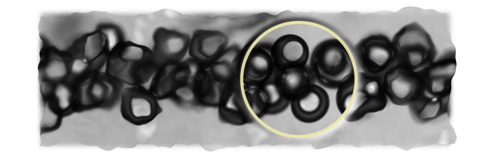

# DE

DE stands for **D**ouble **E**mulsion.
It's the experimental system I am working with at PMMH-ESPCI with Eric Clement, Anke Lindner and Teresa Lopez-Leon.

In this repository, I save the notes, code, illustrations and eventually the draft for the research paper of this project. The structure plan of this repository is shown below.
```
|- DE
  README.md
  |- Code
  |- Illustrations (deprecated)
  |- Images (automated image folder for Markdown writer)  
  |- Notes (note product, blog-like summary)
  |- Log (note draft)
  |- Protocols
  |- MSCA (the EU commission Marie Curie fellowship proposal)
```
**Some structural edits:**
- Dec 15, 2021 -- i) use main readme.md for to-do's, ii) put notes in *obsidian* style, i.e. .md's in the Notes folder and all images mix in *img* folder.
- Jan 12, 2021 -- i) Use task list for to-do's

---

### Development

- [x] a merged file system solution, such as [mergerfs](https://github.com/trapexit/mergerfs). (Some remarks after implementation: the document looks overwelming at the first glance. There seemed to be a lot of configurations to )
