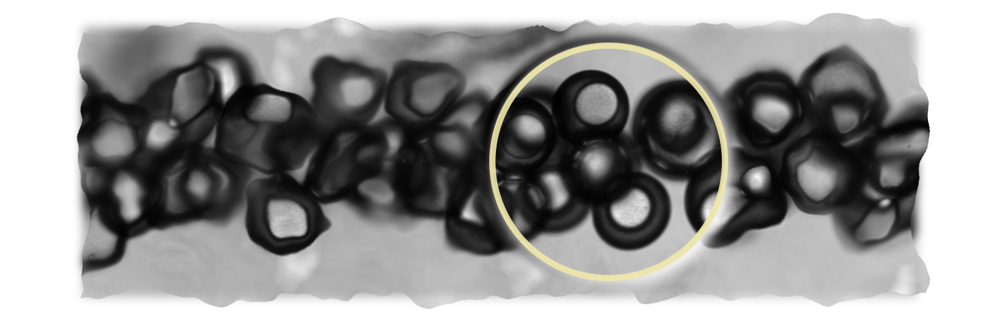

# DE

DE stands for **D**ouble **E**mulsion.
It's the experimental system I am working with at PMMH-ESPCI with Eric Clement, Anke Lindner and Teresa Lopez-Leon.

In this repository, I save the notes, code, illustrations and eventually the draft for the research paper of this project. The structure plan of this repository is shown below.
```
|- DE
  README.md
  |- Code
  |- Illustrations (deprecated)
  |- Images (automated image folder for Markdown writer)  
  |- Notes
  |- (Draft)
  |- Log
  |- Protocols
  |- MSCA (the EU commission Marie Curie fellowship proposal)
```
**Some structural edits:**
- Dec 15, 2021 -- i) use main readme.md for to-do's, ii) put notes in *obsidian* style, i.e. .md's in the Notes folder and all images mix in *img* folder.
- Jan 12, 2021 -- i) Use task list for to-do's

---

## To-do list

### Collective motion note
- [x] PIV should be run again with `PIV_masked()` instead of `piv_drop`, batch script needs to be implemented
- [x] compare BF and fluorescence image PIV
- [x] temporal evolution of velocity: does bacterial activity decay with time in droplets? What's the typical time scale?
- [x] order parameter
- [ ] Order parameter in different regions
- [ ] spatial autocorrelation length: this can be the first observable for temporal activity evolution
- [ ] temporal autocorrelation
- [ ] better illustrate velocity profile
- [ ] PIV movies
- [ ] How much does optical distortions of images affect the PIV analysis? (Vladescu et al. 2014)
- [ ]

### Experiment
- [ ] Compare bacterial motility in MB with and without L-serine, especially long time.
- [x] Compare the motility decreasing characteristics with and without pumping oxygen into oil. A [simple calculation](finish_the_note) shows this is a possible solution to the oxygen gradient.
- [ ] Laser on and off periodically to test the effect of laser on the motility
- [ ] Use PDMS (instead of glass) as the specimen chamber lid.
- [ ] Density match the bacterial suspensions using percoll (what do I expect to see if the density is matched? How can I tell if density is matched?)
- [ ] Use oxygen indicators and DDM to verify the existence of oxygen gradient. (Vladescu et al. 2014)

### Data analysis
- [ ] Make all in one visualization (piv_overlay, order parameter, velocity profile, mean velocity)
- [ ] a merged file system solution, such as [mergerfs](https://github.com/trapexit/mergerfs) (long term)
- [ ] Try out object-oriented programming (OOP), by enclose a video (dir) along with all the analyses as the methods in the object. Use the file system as database. (long term)

---

## I. "Thermometer" in an active bath
April 19, 2021
#### Project summary

We devise a "thermometer" for an active bath using double emulsions.
Specifically, we confine swimming *E. coli* bacteria in the aqueous phase of oil/water/oil double emulsions and examine the motions of the inner oil droplets.
Surrounded by swimming bacteria, the inner oil droplets exhibit stronger fluctuations, deviating from familiar Brownian motion.
In this study, we combine microfluidic techniques and advanced imaging techniques to investigate:
- generalized temperature in active matter systems
- whether boundary conditions, especially curvature, affect the temperature
- to what extent thermodynamic tools can be generalized to active matter systems

## II. Collective motion in droplets
Jan 12, 2022

## III. Sliding on soft interface

## IV. Wobbling in droplets
